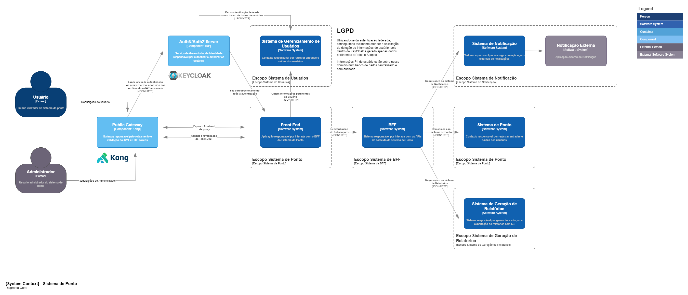
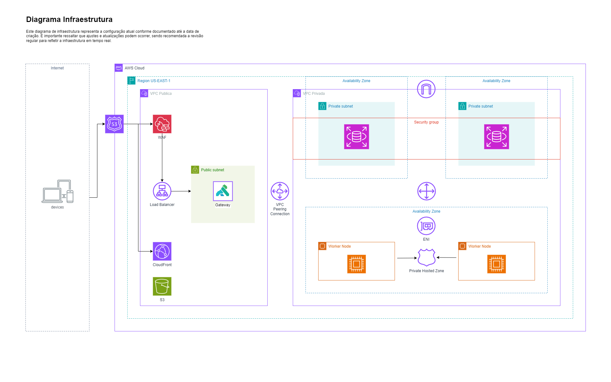

# Documentação Técnica Hackathon

A finalidade deste repositório é ser o centralizador da documentação da entrega do Hackathon.

## Arquitetura da Solução

Abaixo segue a modelagem da nossa solução no modelo C4 de diagramação.

### 00 - Sistema de Ponto Apresentação (Videos)

* [Diagrama de Contexto](https://drive.google.com/file/d/1j72wHzdBX9-wtaJswLj4Cje7J-P0tmGo/view?usp=drive_link)
* [Diagrama de Pipeline](https://drive.google.com/file/d/1ItkymvwbfrRB9_PWOb2fXVqYaJCAjrh2/view?usp=sharing)
* [Diagrama de Infraestrutura](https://drive.google.com/file/d/1Bmvg6Iirn9Egw3E4BTnQGWoZZarIWG_l/view?usp=sharing)

### 01 - Sistema de Ponto System Context

### 02 - Sistema de Ponto Pipeline

### 02 - Sistema de Ponto Infraestrutura

