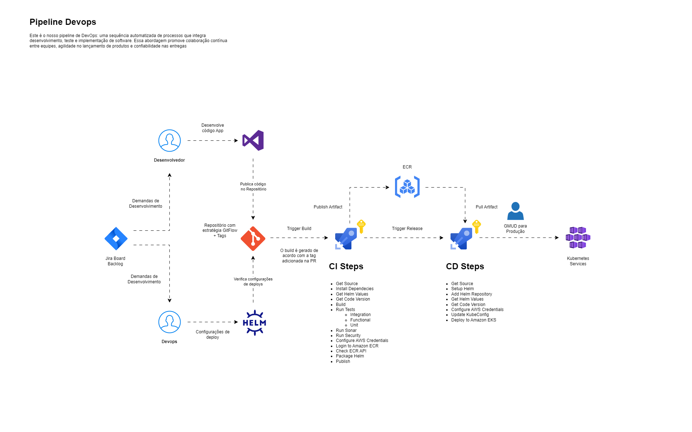

# Documentação Técnica Hackathon

A finalidade deste repositório é ser o centralizador da documentação da entrega do Hackathon.

## Arquitetura da Solução

Abaixo segue a modelagem da nossa solução no modelo C4 de diagramação.

### 01 - Sistema de Ponto System Context

### XX - Sistema de Ponto Pipeline

